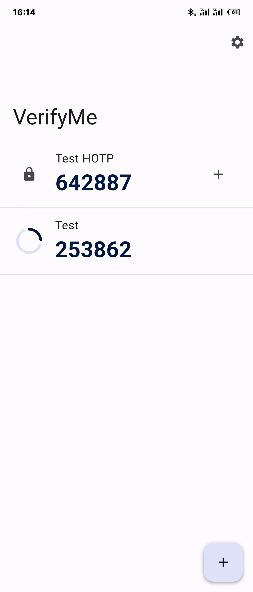
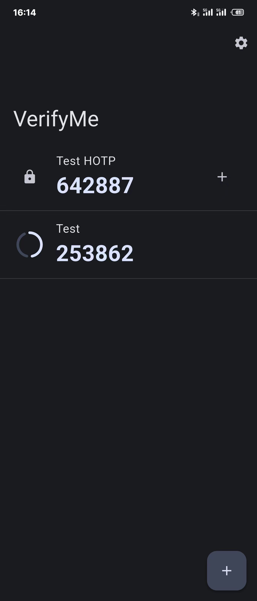
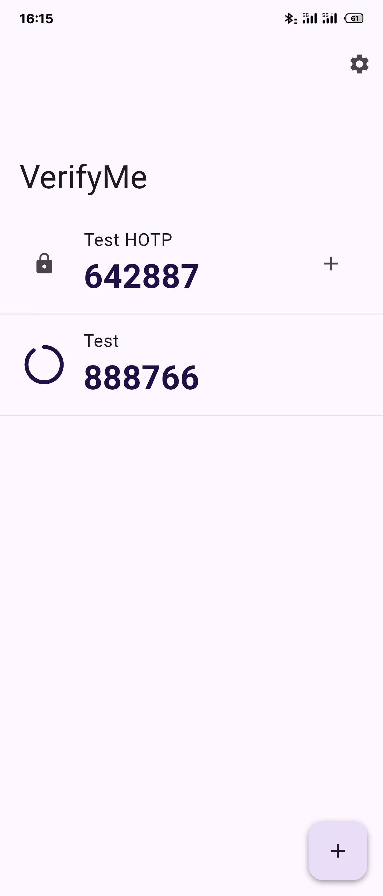
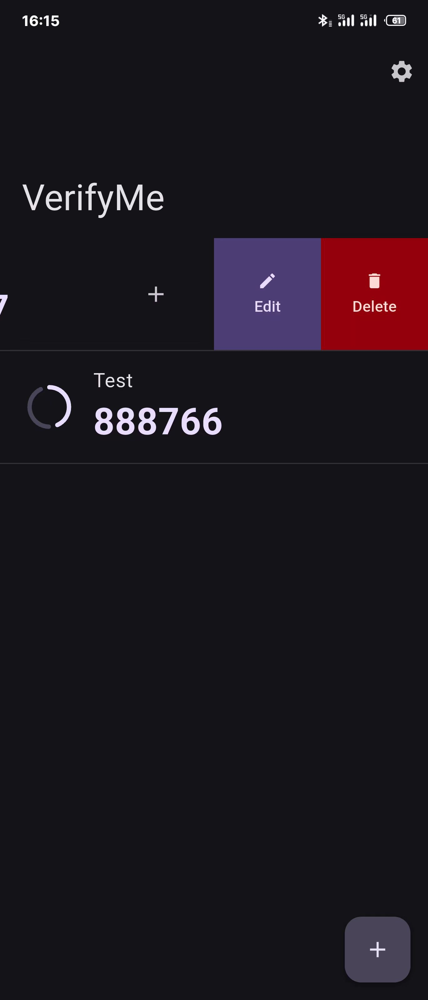
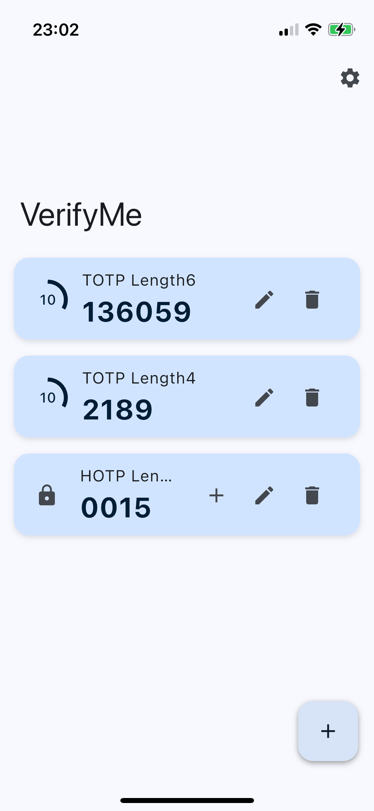
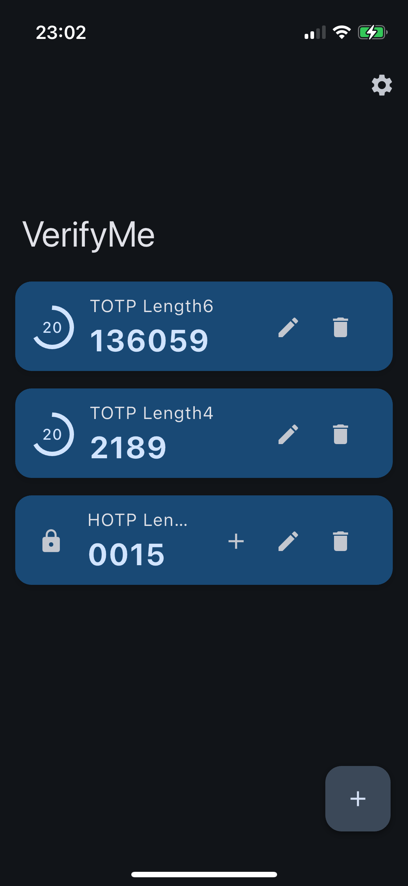
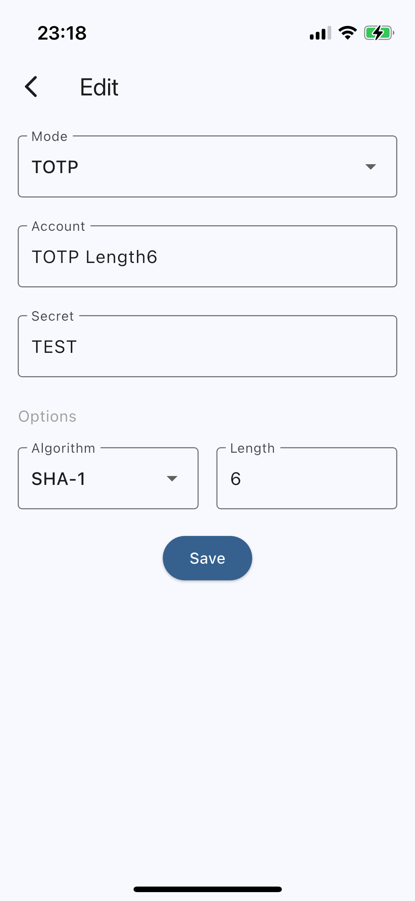
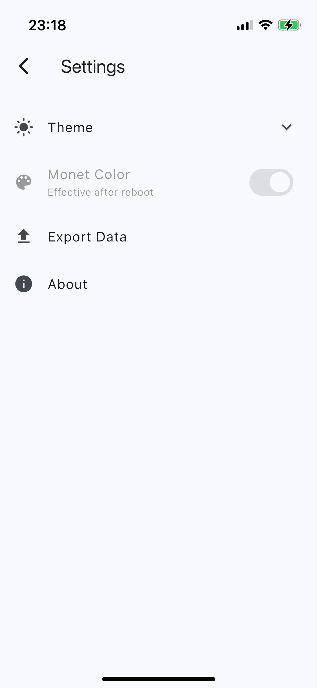

English | [简体中文](README_CN.md)

    

# VerifyMe
VerifyMe by Linxing Huang
 
A simple, opensource Authenticator app.
 

## Features
- QR Code Scanning
- i18n Support
- Private Protection
- Click Quick Copy
- Backup and Restore in JSON
- Monet Color
- Android 12+ Material Design

## Screenshots
### Android - Monet Color (Running on Meizu 21 Pro)

    
    

### Android - Non Monet Color (Running on Meizu 21 Pro)

    
    

### iOS (Running on iPhone13 mini) (Outdated)

    
    

### Scan、Edit/Input、Settings

    
    
    

## License
[MIT](LICENSE) © Linxing Huang