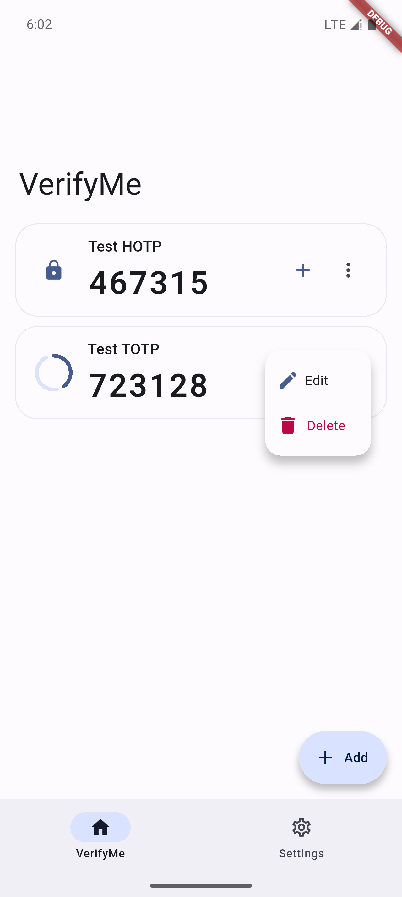
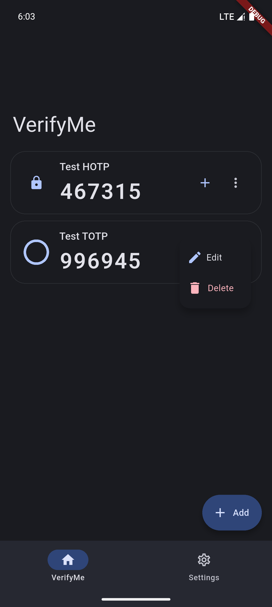

English | [简体中文](README_CN.md)

    

# VerifyMe

VerifyMe by Linxing Huang
 
A simple, opensource Authenticator app.
 

## Features

- QR Code Scanning
- i18n Support
- Private Protection
- Click Quick Copy
- Backup and Restore in Local JSON file or WebDAV
- Monet Color
- Android 12+ Material Design

## Screenshots

<table>
  <tr>
    <td></td>
    <td></td>
  </tr>
  <tr>
    <td></td>
    <td></td>
  </tr>
</table>

## License

[MIT](LICENSE) © Linxing Huang
