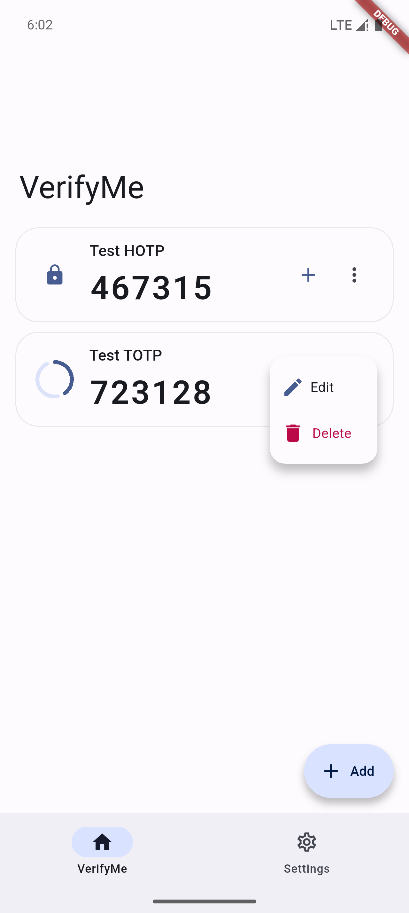
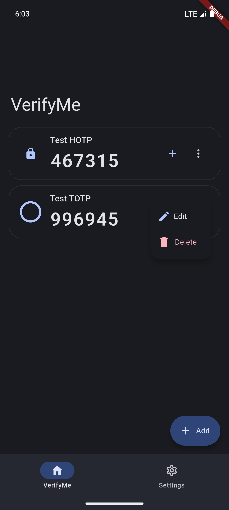
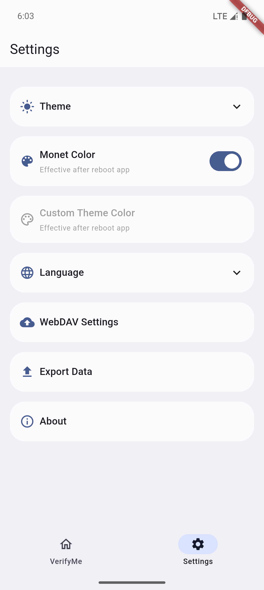
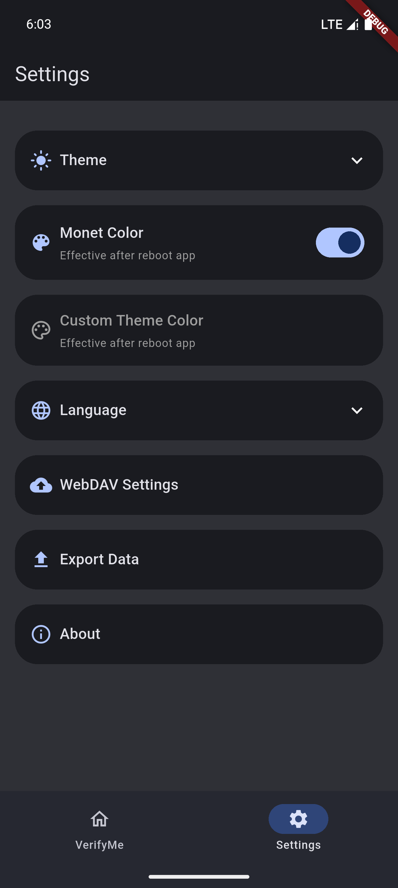

[English](README.md) | 简体中文

    

# VerifyMe

VerifyMe by Linxing Huang
 
一个简单、开源的二重验证码生成器。
 

## 特性

- 二维码扫描输入
- 多语言支持
- 隐私保护
- 单击快速复制
- 通过本地 Json 文件导入导出、WebDAV 备份和恢复
- 莫奈取色
- Material Design

## 截图

<table>
  <tr>
    <td></td>
    <td></td>
  </tr>
  <tr>
    <td></td>
    <td></td>
  </tr>
</table>

## 许可证

[MIT](LICENSE) © Linxing Huang
