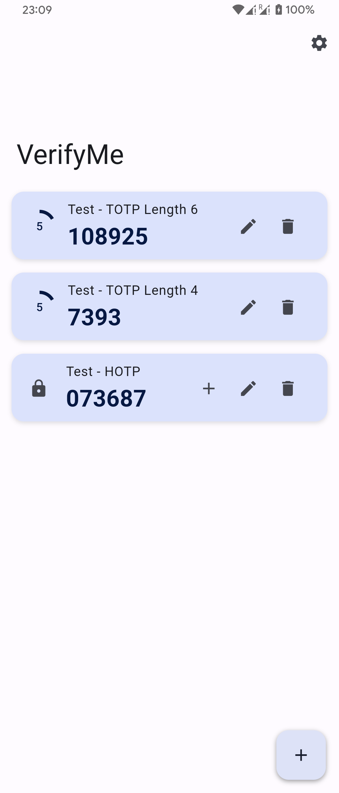
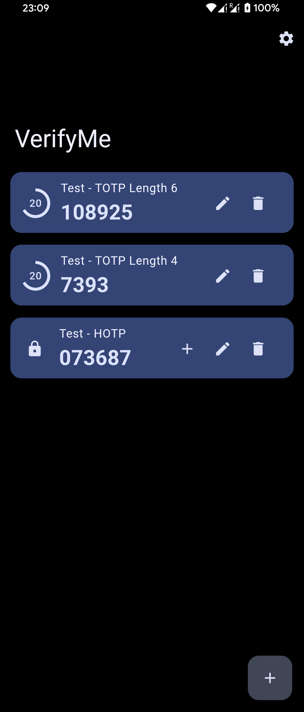
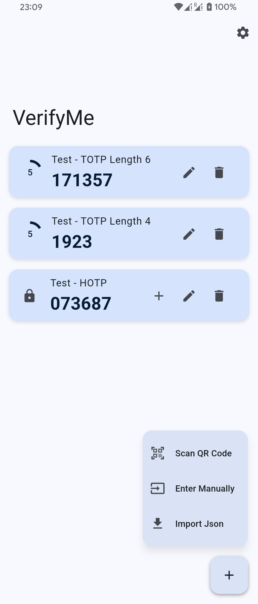
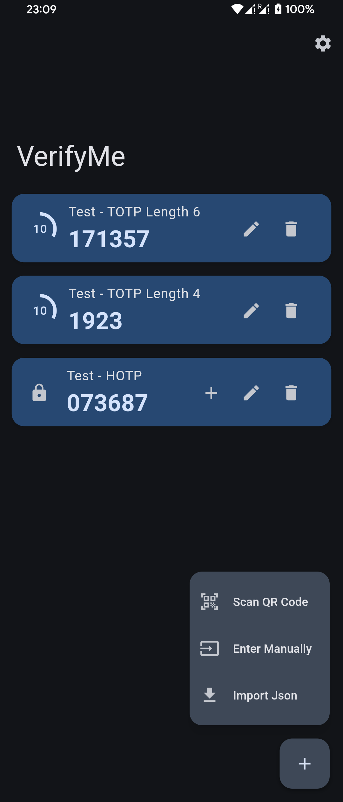

[English](README.md) | 简体中文

    

# VerifyMe
VerifyMe by Linxing Huang
 
一个简单、开源的双重验证码生成器。
 

## 特性
- 二维码扫描输入
- 隐私保护
- 单击快速复制
- 通过Json文件备份和恢复
- Monet取色
- Material Design

## 截图
### Android - Monet Color (Running on Xperia 5 II)

### Android - Non Monet Color (Running on Xperia 5 II)

### iOS (Running on iPhone13 mini)

### Scan、Edit/Input、Settings

## 许可证
[MIT](LICENSE) © Linxing Huang